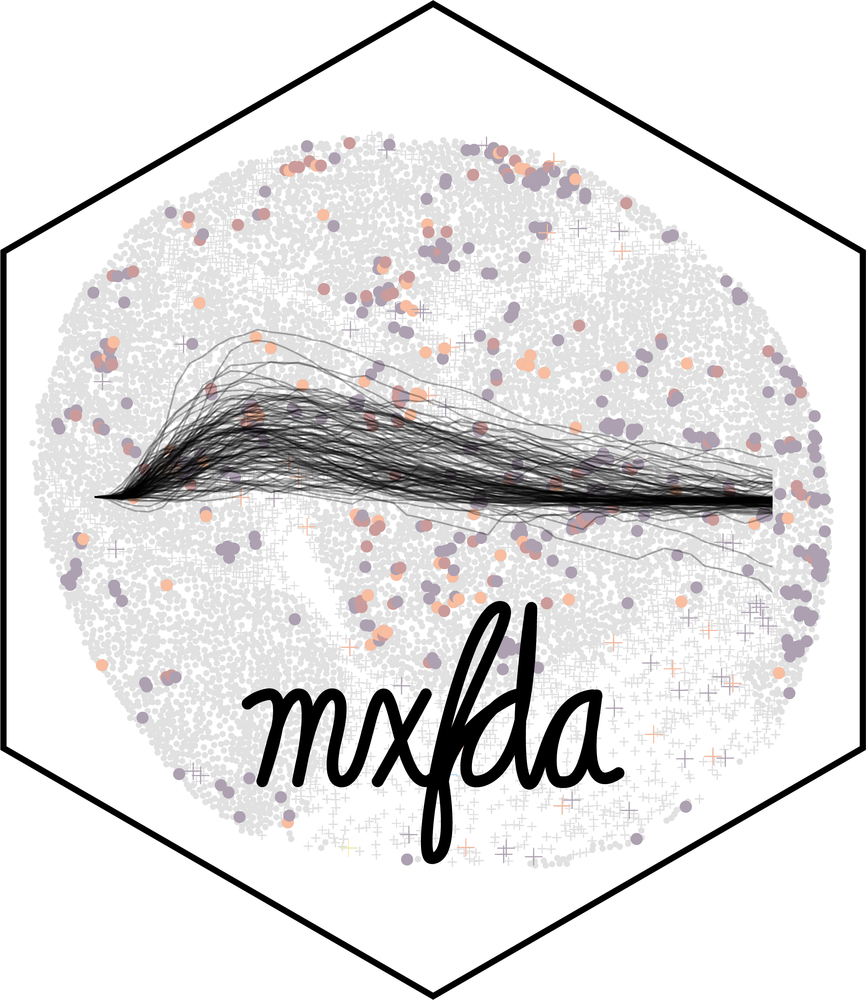

# mxfda 

<!-- badges: start -->
[](https://CRAN.R-project.org/package=mxfda)
[](https://CRAN.R-project.org/package=mxfda)
[](https://CRAN.R-project.org/package=mxfda)
[](https://github.com/julia-wrobel/mxfda/actions/workflows/R-CMD-check.yaml) 
[](https://github.com/julia-wrobel/mxfda/actions/workflows/test-coverage.yaml)
<!-- badges: end -->

<!--
-->
## mxFDA

A functional data analysis package for spatial point pattern data.

## Installing mxFDA to R

To install, the `devtools` or `remotes` package is required for the `install_github()` function:

```
#install devtools if not available
if (!require("devtools", quietly = TRUE))
  install.packages("devtools")

#install from github
devtools::install_github("julia-wrobel/mxfda")
```

To install a specific release of `mxfda`, use the `devtools` syntax. This is an example for installing the first release of `mxfda`:

```
devtools::install_github('julia-wrobel/mxfda@v0.2.2')
```

## Vignettes and Function References

If interested in documentation and how-to's, please see http://juliawrobel.com/mxfda/

## GitHub Code

The raw code can be found on the GitHub page by clicking the GitHub symbol in the upper right of the `pkgdown` site or at https://github.com/julia-wrobel/mxfda
